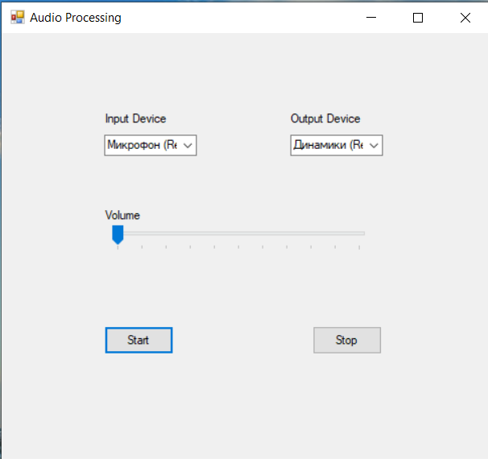

# Audio-Processing

## Overview
This GUI application provides real-time audio signal attenuation. It allows users to select input and output audio devices, adjust volume attenuation, and control the signal flow with start and stop buttons.

## Features
- **Select Input Audio Device:** Users can choose the input audio device from the available options.
- **Select Output Audio Device:** Users can select the output audio device for the attenuated signal.
- **Adjust Volume Attenuation:** A volume knob is provided to adjust the attenuation gain for the audio signal.
- **Start/Stop Control:** Start and stop buttons control the flow of audio signal processing.

# Installation

   - Navigate to the [Installation folder](Audio-Processing/Installation/) of this repository.
   - Double-click on the installer file or on the `.exe` to run the installation.
   - Follow the on-screen instructions to complete the installation process.


## How to Use
1. **Select Audio Devices:**
   - Click on the dropdown menus to select the desired input and output audio devices.

2. **Adjust Volume Attenuation:**
   - Use the volume knob to increase or decrease the attenuation gain for the audio signal.

3. **Start/Stop Processing:**
   - Click on the "Start" button to begin capturing and processing the audio signal.
   - Click on the "Stop" button to halt the signal processing.

## Development Setup
1. **Requirements:**
   - Visual Studio 
   - .NET/C# 

2. **Clone Repository:**

```shell
git clone https://github.com/Kalashyan-1/Audio-Processing.git
```

3. **Open Project in Visual Studio:**
- Launch Visual Studio.
- Open the cloned project directory.

4. **Build and Run:**
- Build the project to ensure all dependencies are resolved.
- Run the application to launch the GUI interface.

## Screenshot



## Contributing
Contributions are welcome! If you'd like to enhance this project, feel free to fork the repository and submit a pull request.


